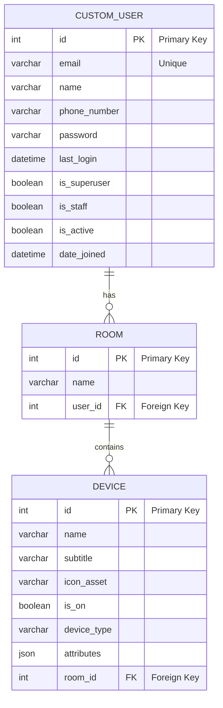

## Sơ đồ cấu trúc Database

Sơ đồ này mô tả mối quan hệ giữa các model `CustomUser`, `Room`, và `Device`.

```mermaid
erDiagram
    CUSTOM_USER {
        int id PK "Primary Key"
        varchar email "Unique"
        varchar name
        varchar phone_number
        varchar password
        datetime last_login
        boolean is_superuser
        boolean is_staff
        boolean is_active
        datetime date_joined
    }

    ROOM {
        int id PK "Primary Key"
        varchar name
        int user_id FK "Foreign Key"
    }

    DEVICE {
        int id PK "Primary Key"
        varchar name
        varchar subtitle
        varchar icon_asset
        boolean is_on
        varchar device_type
        json attributes
        int room_id FK "Foreign Key"
    }

    CUSTOM_USER ||--o{ ROOM : "has"
    ROOM ||--o{ DEVICE : "contains"
```